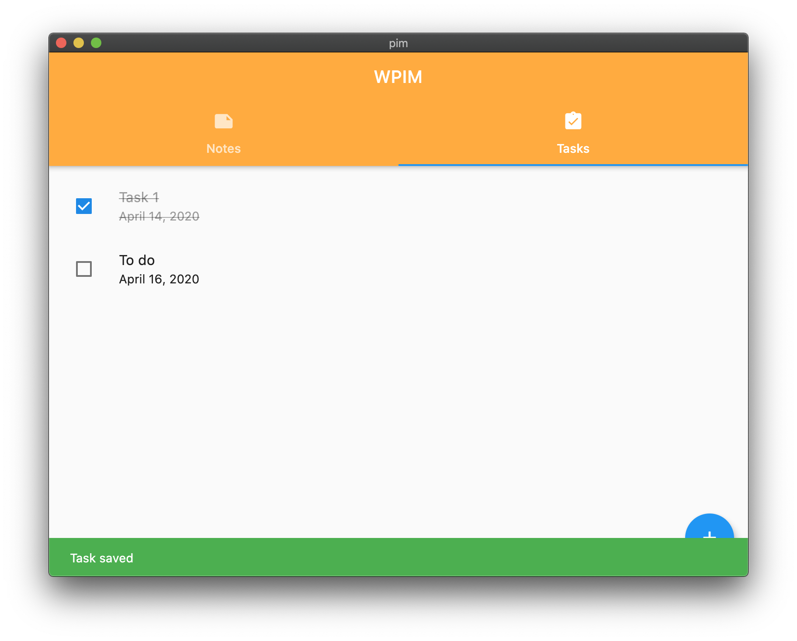
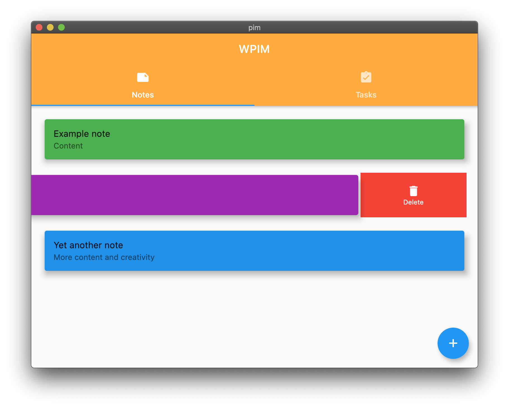

# **WPIM** 💾
*A cross-platform personal information manager written in Dart with the Flutter framework.*

# **Screens**
*The interface is the same across all devices.* 🖥, 📱, 🕸

## Tasks                                            

## Notes

